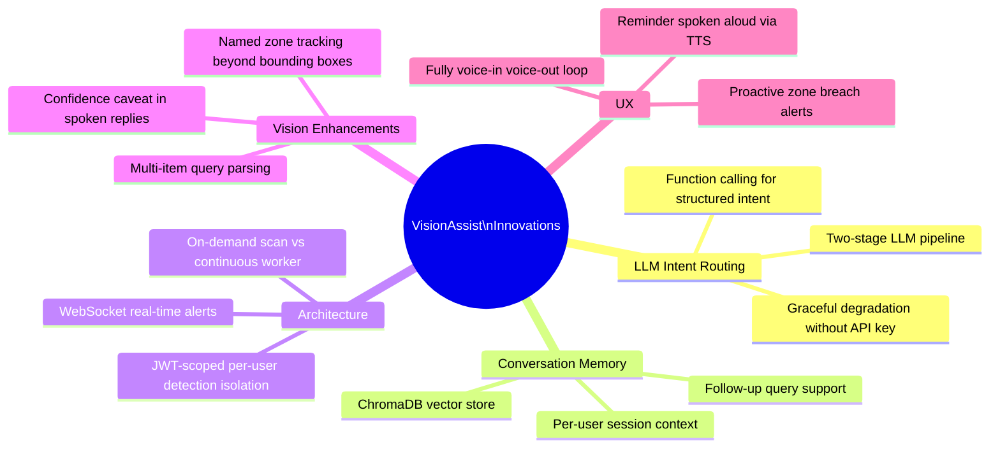
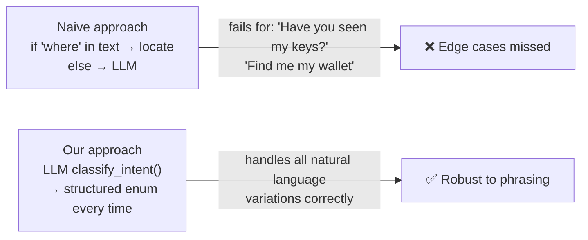
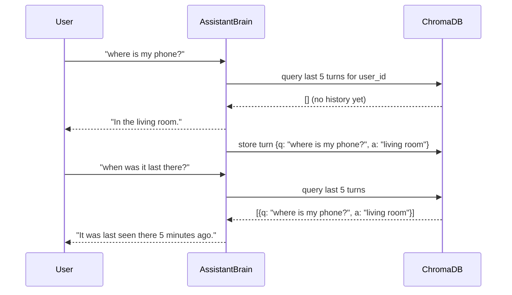

# Innovation & Creativity

> **Rubric:** Innovation & Creativity [15%] — Uniqueness of approach compared to existing solutions. Implementation of innovative functionalities beyond core requirements.

This doc lists every innovation in VisionAssist and maps each to the rubric criterion. Keep this updated as features are added — it becomes part of the presentation script.

---

## Innovation Summary



---

## Innovation 1 — LLM as Intent Classifier (not just fallback)

**What most systems do:** Keyword match ("where", "find", "locate") → LLM only for general Q&A.

**What we do:** Use OpenAI function calling to **classify every query** into a typed intent enum. The model is forced to return structured JSON — no regex, no brittle keyword lists.



**Innovation value:** Turns intent routing from a hard-coded rule set into a language model — the system understands intent, not just keywords.

---

## Innovation 2 — Two-Stage LLM Pipeline (Cost-Optimised)

Most LLM-powered assistants either call the LLM for everything (expensive) or never call it for structured tasks (dumb). We use a **two-stage pipeline**:

| Stage | Purpose | Model call | Cost |
|---|---|---|---|
| Stage 1 | Intent classification | Always (1 call, ~80-100 tokens) | ~$0.00005 |
| Stage 2 | General Q&A answer | Only for `general_qa` intent | ~$0.00020 |

Time/date/locate queries cost **one LLM call**. General Q&A costs two. This means the assistant is cheap to run at scale.

---

## Innovation 3 — Conversation Memory via ChromaDB

**Core requirement:** Stateless question answering.
**Our enhancement:** Per-user conversation history stored as vector embeddings in ChromaDB.



Follow-up queries ("find it again", "when was that?") become natural without repeating context.

---

## Innovation 4 — Named Zone Tracking

**Standard YOLO output:** Bounding box coordinates `[x1, y1, x2, y2]`.

**What we add:** Map every detection to a named human-readable zone ("living room sofa", "kitchen counter") defined by the user. The spoken reply uses zone names, not pixel coordinates.

```
Standard: "Object detected at [120, 80, 240, 200]"
Ours:     "Your phone was last seen in the living room sofa area, 3 minutes ago."
```

Zone definitions are per-camera and per-user — entirely flexible.

---

## Innovation 5 — Confidence-Aware Spoken Replies

When YOLO detection confidence is below 0.60, the reply hedges:

```
High confidence (≥ 0.80):  "Your phone is in the living room."
Medium confidence (0.60-0.79): "I'm fairly confident your phone is in the living room."
Low confidence (< 0.60):   "I think I saw something like your phone in the living room, but I'm not sure — try checking there."
```

This builds user trust rather than giving false certainty.

---

## Innovation 6 — On-Demand Scan Mode (No Always-On Camera Required)

The architecture supports **two detection paths**:

| Mode | How it works | Use case |
|---|---|---|
| **Continuous worker** | Background thread pulls frames from webcam every 1fps | Local deployment with always-on camera |
| **On-demand scan** | Browser captures a frame every 3s and POSTs to `/api/scan` | Cloud demo, laptop webcam, Kaggle GPU |

The same YOLO pipeline handles both — switching is a single env var (`CAMERA_SOURCE=0` vs `CAMERA_SOURCE=none`). This is a significant architectural innovation: the system works without a permanently connected camera.

---

## Innovation 7 — Real-Time WebSocket Alerts

Unlike polling-based alert systems, VisionAssist pushes alerts **instantly** over a persistent WebSocket connection the moment an item leaves its home zone. No page refresh, no polling delay — the alert banner appears in under one detection cycle (~3 seconds).

---

## Beyond Core: Optional Features Roadmap

These map directly to the "Optional Deliverables" in the problem statement:

| Feature | Rubric alignment | Complexity |
|---|---|---|
| Multi-user support | "Allow multiple users to register their belongings" | Already built (owner_id on all entities) |
| Proactive alerts | "Notify users when item moved outside designated area" | Already built (zone breach → WebSocket) |
| Smart reminders | "Set and manage reminders" | Already built |
| Voice-in voice-out loop | Core innovation | Already built |
| Confidence-aware replies | Innovation beyond core | Ready to implement |
| Conversation memory (ChromaDB) | Innovation beyond core | Ready to implement |
