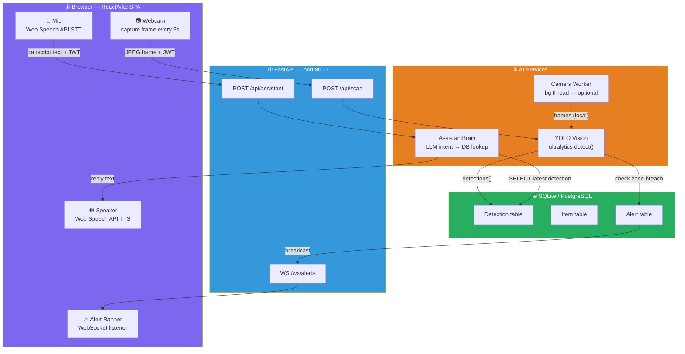
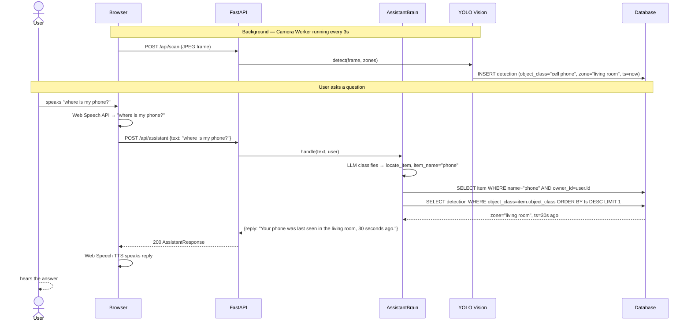
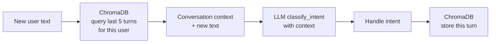

# Integration Plan — Voice + Vision + Backend

> **Rubric:** Integration [15%] — Seamless integration of voice assistant, computer vision, and other components.

This doc covers how all subsystems wire together into a single working product. Each owner's component is a black box with a defined contract; this doc is the contract registry.

---

## End-to-End Data Flow



---

## Component Contracts

### STT → AssistantBrain (Anuj → Shubham)

```
POST /api/assistant
Authorization: Bearer <JWT>
Content-Type: application/json

Body:   { "text": "<transcribed string from Web Speech API>" }
Reply:  { "reply": "...", "intent": "locate_item", "data": {...} }
```

- Anuj's STT module calls this endpoint with whatever text the browser produces.
- Shubham's brain handles everything from that point.
- No shared state — purely HTTP.

---

### YOLO → Detection DB (Sanjay → Shubham)

```
POST /api/scan
Authorization: Bearer <JWT>
Content-Type: multipart/form-data

Body:   image=<JPEG bytes>
Reply:  { "detections": [ { "object_class", "confidence", "zone_name", "bbox" } ] }
```

- The browser (or Sanjay's camera worker) sends a frame.
- Shubham's YOLO wrapper detects, assigns zones, writes to Detection table, checks zone breaches.
- Sanjay's camera worker calls this same endpoint — no code change needed on either side.

---

### Alert → WebSocket → Browser (Shubham → Frontend)

```
WS ws://localhost:8000/ws/alerts?token=<JWT>

Server pushes: { "type": "alert", "message": "Keys left living room", "item": "keys", "ts": "..." }
```

- On zone breach, Shubham's alerts service calls `hub.broadcast(owner_id, payload)`.
- Browser receives it on the open socket and shows the alert banner.
- No polling needed.

---

## Integration Sequence — The "Where is my phone?" Golden Path



---

## Integration Test Checklist

| # | Test | Expected | Owner |
|---|---|---|---|
| 1 | POST /api/assistant `{"text": "what time is it"}` with valid JWT | Returns current time in reply | Shubham |
| 2 | POST /api/scan with a photo containing a phone | Detection inserted in DB, `object_class=cell phone` | Shubham + Sanjay |
| 3 | POST /api/assistant `{"text": "where is my phone"}` after test 2 | Returns "living room" or wherever detected | Shubham |
| 4 | Item moves outside home zone → WebSocket push fires | Browser receives `{ type: "alert" }` within 1 scan cycle | Shubham + Anuj |
| 5 | STT transcript sent from browser voice capture → TTS speaks reply | Full round-trip voice in, voice out | All |
| 6 | All routes return 401 without JWT | 401 Unauthorized | Shubham |

---

## ChromaDB — Conversation Memory (Enhancement)

ChromaDB is already in the stack (`chromadb` in `requirements.txt`). We can use it to persist the last N conversation turns per user, enabling follow-up queries like:

```
User: "where is my phone?"
AI:   "Living room."
User: "when was it last there?"  ← needs memory of previous turn
```



This adds meaningful innovation value (15% rubric criterion) with minimal effort since ChromaDB is already installed.
