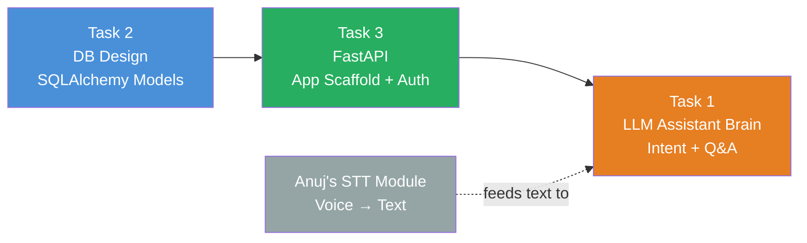

# Milestone 3 — Voice Assistant Development

> **Owner:** Shubham | **Due:** 6/26/2026 (Tasks 1 & 2), TBD (Task 3)

This milestone delivers the core backend of VisionAssist: the database layer, the FastAPI service, and the LLM-powered assistant brain. Together they form the "spine" that every other component — voice I/O, camera worker, frontend — plugs into.

---

## Task Map



**Build order:** DB Design → FastAPI scaffold → LLM Assistant Brain

---

## What Each Task Delivers

| Task | What it is | Key output |
|---|---|---|
| [Task 2 — DB Design](./task2-db-design.md) | SQLAlchemy ORM models for all entities | `backend/models/` — all tables, relationships, migrations |
| [Task 3 — FastAPI](./task3-fastapi-architecture.md) | App skeleton, JWT auth, all routers | `backend/` — runnable API on port 8000 |
| [Task 1 — LLM Assistant Brain](./task1-llm-assistant-brain.md) | LLM-powered intent routing + Q&A service | `backend/services/assistant.py` — `POST /api/assistant` |

---

## System Context (Where These Tasks Fit)

```mermaid
graph TD
    subgraph Client ["① Client — React SPA"]
        VOICE[Voice I/O\nWeb Speech API]
        CAM[Webcam Capture]
        ALERT[Live Alert Banner]
    end

    subgraph API ["② FastAPI — Task 3"]
        AUTH_R[/api/auth]
        ITEMS_R[/api/items & zones]
        ASST_R[/api/assistant]
        SCAN_R[/api/scan]
        REM_R[/api/reminders]
        WS_R[/ws/alerts]
    end

    subgraph SERVICES ["③ Processing & AI Services"]
        BRAIN[Assistant Brain\nTask 1 — LLM]
        CAM_W[Camera Worker\nYOLO Vision]
    end

    subgraph DATA ["④ Data — Task 2"]
        DB[(SQLite / PostgreSQL\nSQLAlchemy ORM)]
    end

    VOICE -->|POST /api/assistant + JWT| ASST_R
    CAM -->|POST /api/scan + JWT| SCAN_R
    ALERT <-->|WebSocket| WS_R

    ASST_R --> BRAIN
    SCAN_R --> CAM_W

    BRAIN --> DB
    CAM_W --> DB

    API --> DB

    style Client fill:#7B68EE,color:#fff
    style API fill:#3498DB,color:#fff
    style SERVICES fill:#E67E22,color:#fff
    style DATA fill:#27AE60,color:#fff
```

---

## All Docs in This Folder

| Doc | Covers | Rubric |
|---|---|---|
| [milestone3-overview.md](./milestone3-overview.md) | This file — task map, system context, checklist | — |
| [task2-db-design.md](./task2-db-design.md) | ER diagram, SQLAlchemy models, indexes | Implementation 35% |
| [task3-fastapi-architecture.md](./task3-fastapi-architecture.md) | Router map, JWT auth, API contracts, WebSocket | Implementation 35% + Design 10% |
| [task1-llm-assistant-brain.md](./task1-llm-assistant-brain.md) | LLM intent routing, two-stage pipeline, system prompt | Implementation 35% + Innovation 15% |
| [integration-plan.md](./integration-plan.md) | End-to-end data flow, component contracts, ChromaDB memory | Integration 15% |
| [testing-and-evaluation.md](./testing-and-evaluation.md) | mAP metrics, latency budgets, test suite, known limitations | Documentation 15% |
| [innovation-features.md](./innovation-features.md) | All innovations mapped to rubric, optional features roadmap | Innovation 15% |
| [links.md](./links.md) | All project links — rubric, task tracker, references | — |

---

## Rubric Coverage Status

| Criterion | Weight | Status | Doc |
|---|---|---|---|
| Implementation | 35% | 🟡 Planned | task2, task3, task1 |
| Design & Architecture | 10% | 🟡 Planned | task3 |
| Integration | 15% | 🟡 Planned | integration-plan |
| Documentation | 15% | 🟢 Documented | testing-and-evaluation |
| Innovation & Creativity | 15% | 🟢 Documented | innovation-features |
| Presentation | 10% | ⬜ Not started | — |

---

## Milestone Completion Checklist

**Task 2 — DB Design**
- [ ] All 7 SQLAlchemy models defined (`User`, `Item`, `Camera`, `Zone`, `Detection`, `Reminder`, `Alert`)
- [ ] `init_db()` runs clean — tables created
- [ ] Indexes added on `Detection.object_class` and `Detection.timestamp`

**Task 3 — FastAPI**
- [ ] FastAPI app starts: `uvicorn backend.main:app --reload`
- [ ] JWT register + login flow works (`/api/auth/register`, `/api/auth/login`)
- [ ] All 9 routers registered and returning correct status codes
- [ ] All routes return 401 without a valid JWT
- [ ] `/docs` Swagger UI loads cleanly

**Task 1 — LLM Assistant Brain**
- [ ] `POST /api/assistant` returns structured intent + reply for all 5 intents
- [ ] `locate_item` correctly queries DB and returns zone + time
- [ ] `general_qa` calls OpenAI chat completion with system prompt
- [ ] Graceful degradation when `OPENAI_API_KEY` not set
- [ ] Integration test: speak → STT → POST → TTS round-trip works

**Cross-cutting**
- [ ] All 6 integration tests in `integration-plan.md` pass
- [ ] YOLO mAP ≥ 0.70 on test image set
- [ ] p50 API latency < 800ms
