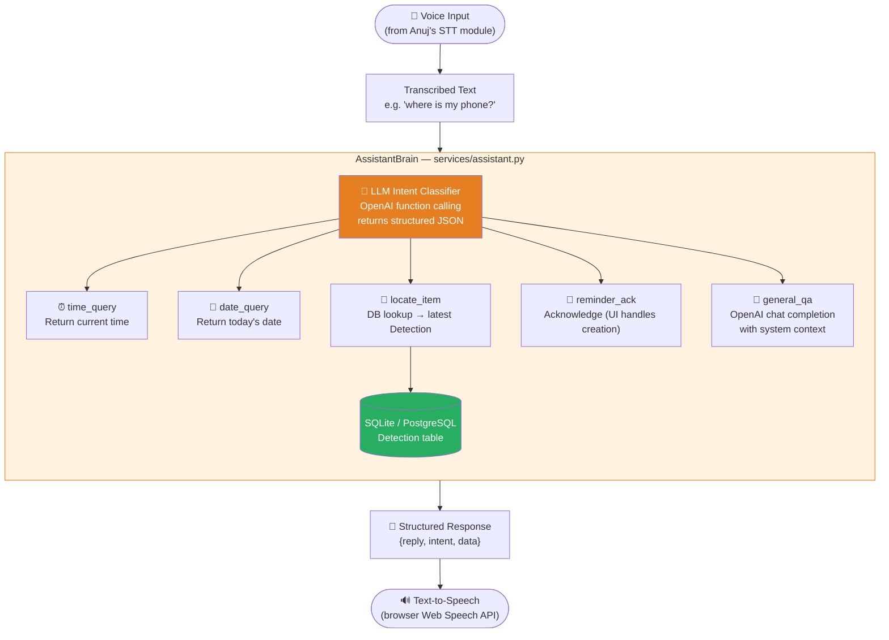
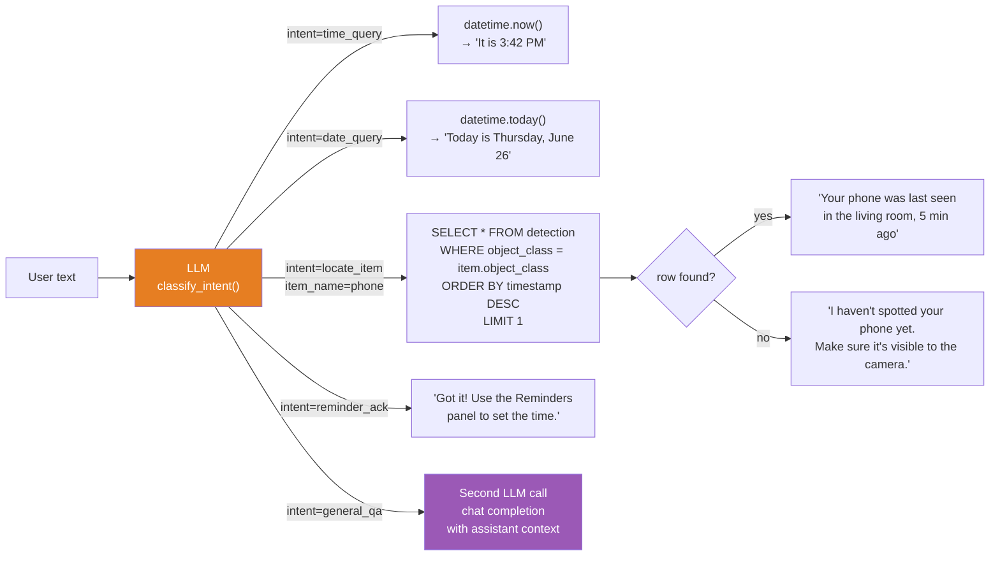
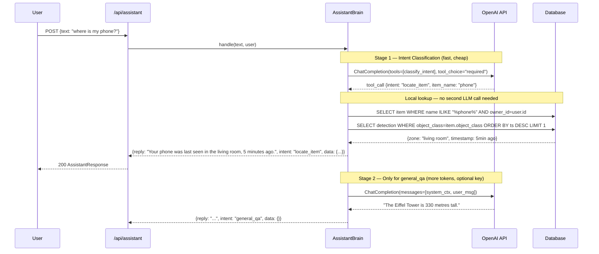
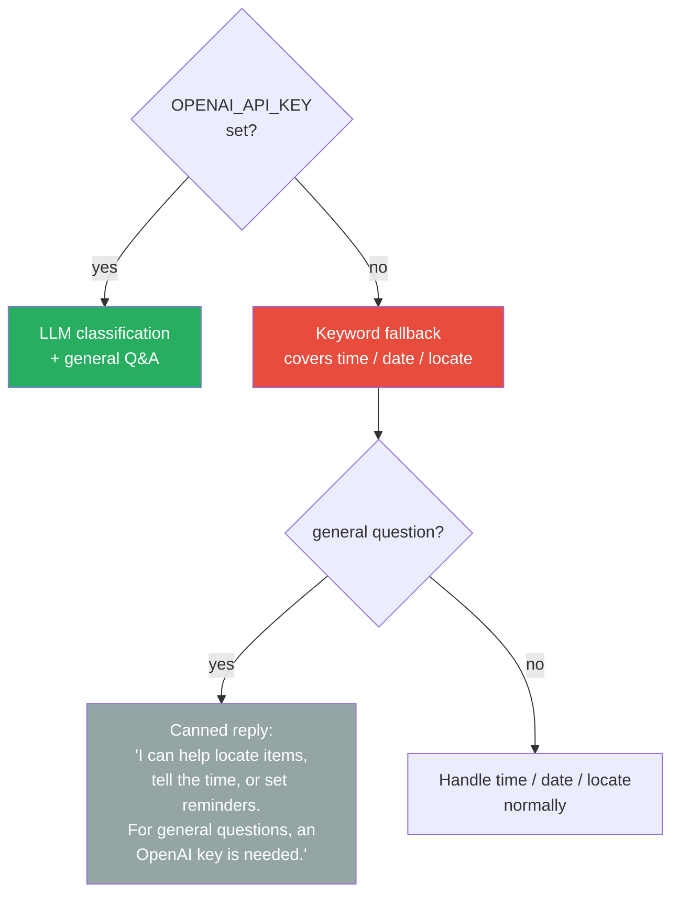

# Task 1 — LLM-Powered Assistant Brain

> **Owner:** Shubham | **Due:** 6/26/2026 (after STT module by Anuj)
> **Stack:** OpenAI API (function calling) · LangChain (optional) · FastAPI · SQLAlchemy

---

## Why LLM — Not Just Keyword Matching

The original plan was keyword rules with an LLM fallback. We're going further: **use the LLM itself as the intent classifier** via OpenAI function calling (structured outputs).

| Approach | "Where's my phone?" | "Have you seen my charger?" | "Find the keys near the couch" |
|---|---|---|---|
| Keyword matching | ✅ matches "where" | ❌ misses | ❌ misses |
| LLM function calling | ✅ | ✅ | ✅ |

Function calling forces the model to return a structured JSON intent — no parsing, no regex, no edge cases.

---

## Architecture



---

## Intent Schema (OpenAI Function Calling)

The LLM is given one function to call: `classify_intent`. It must return one of these:

```json
{
  "name": "classify_intent",
  "parameters": {
    "type": "object",
    "properties": {
      "intent": {
        "type": "string",
        "enum": ["time_query", "date_query", "locate_item", "reminder_ack", "general_qa"]
      },
      "item_name": {
        "type": "string",
        "description": "The item to locate — only present when intent is locate_item"
      },
      "reminder_text": {
        "type": "string",
        "description": "What the user wants to be reminded about — only for reminder_ack"
      }
    },
    "required": ["intent"]
  }
}
```

The model is **forced** to call this function — it cannot output free text for classification. This gives deterministic, parseable intent every time.

---

## Intent Routing Flow



---

## Two-Stage LLM Usage



---

## System Prompt Design

The system prompt for **general_qa** gives the LLM its persona and constraints:

```
You are VisionAssist, a helpful home AI assistant.
You help users locate misplaced belongings using computer vision.
You can answer general questions, tell the time/date, and locate registered items.

Current date/time: {datetime}
Registered items for this user: {item_list}

Be concise and friendly. Respond in 1-2 sentences maximum.
If the user asks you to locate an item, you have already handled it via a database lookup — do not guess locations.
```

---

## LLM Cost Optimisation

| Intent | LLM calls | Estimated tokens | Cost per query |
|---|---|---|---|
| time_query | 1 (classify only) | ~80 | ~$0.00004 |
| date_query | 1 (classify only) | ~80 | ~$0.00004 |
| locate_item | 1 (classify only) | ~100 | ~$0.00005 |
| reminder_ack | 1 (classify only) | ~80 | ~$0.00004 |
| general_qa | 2 (classify + chat) | ~500 | ~$0.00025 |

Using `gpt-4o-mini` keeps costs negligible. Only general Q&A hits the model twice.

---

## Graceful Degradation



The assistant is **fully functional** without an API key for the three core intents. General Q&A degrades gracefully to an informative canned message.

---

## Enhancements We Can Add

| Enhancement | Complexity | Value |
|---|---|---|
| **Conversation memory** — remember last 5 exchanges per user (ChromaDB already in stack) | Medium | User can say "find it again" |
| **Proactive suggestions** — if item unseen for >1hr, LLM drafts a reminder | Medium | Delight feature |
| **Multi-item query** — "where are my keys AND wallet?" | Low | Parse two item names from intent |
| **Confidence caveat** — if detection confidence <0.6, say "I think I saw it in..." | Low | Honesty / trust |
| **Switch to Claude** — `anthropic` SDK, `tool_use` instead of `function_calling` | Low | Better reasoning, same pattern |
