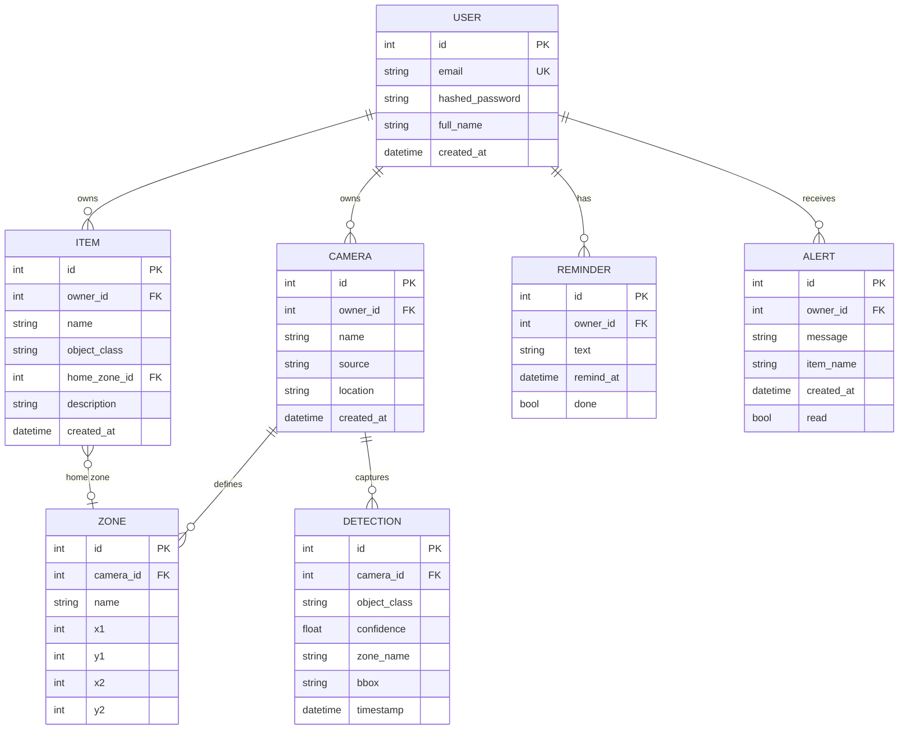
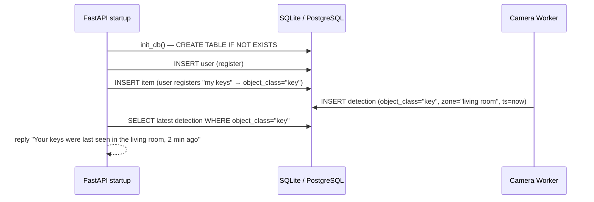

# Task 2 — DB Design

> **Owner:** Shubham | **Due:** 6/26/2026 | **Stack:** SQLAlchemy ORM · SQLite (dev) → PostgreSQL (prod)

---

## Entity-Relationship Diagram



---

## Why These Design Decisions

| Decision | Rationale |
|---|---|
| `object_class` on `Item` (not a name) | YOLO returns class labels — item maps its friendly name to the exact class YOLO detects |
| `home_zone_id` nullable on `Item` | Items without a home zone still get tracked; alerts only fire when a home zone is set |
| `Detection` is append-only | Never update detections — query the latest one to answer "where is my X?" |
| `done=true` marks Reminder in same GET call | Ensures each reminder fires exactly once (no double-speak) |
| Separate `Camera` entity | Enables per-camera scoping — each user can have multiple cameras/rooms |
| `Alert.read` flag | Frontend can show unread count badge without deleting alerts |

---

## File Structure

```
backend/
└── models/
    ├── __init__.py       # exports Base, engine, SessionLocal, init_db
    ├── database.py       # SQLAlchemy engine + session factory
    ├── user.py
    ├── item.py
    ├── camera.py
    ├── zone.py
    ├── detection.py
    ├── reminder.py
    └── alert.py
```

---

## SQLite → PostgreSQL Switch

The only line that changes between dev and prod:

```python
# dev (default)
DATABASE_URL = "sqlite:///./visionassist.db"

# prod — set in .env
DATABASE_URL = "postgresql://user:pass@db:5432/visionassist"
```

SQLAlchemy handles everything else. No model changes required.

---

## Indexes to Add (Performance)

```python
# On Detection — the two most-queried columns
Index("ix_detection_object_class", Detection.object_class)
Index("ix_detection_timestamp",    Detection.timestamp)

# On Alert — for unread count queries
Index("ix_alert_owner_read", Alert.owner_id, Alert.read)
```

---

## DB Lifecycle Flow


