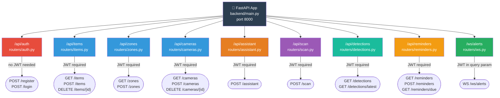
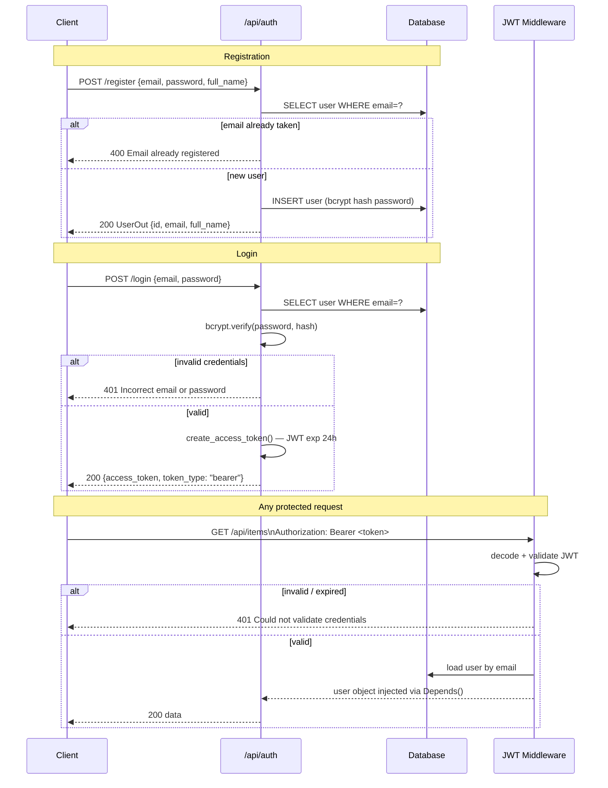
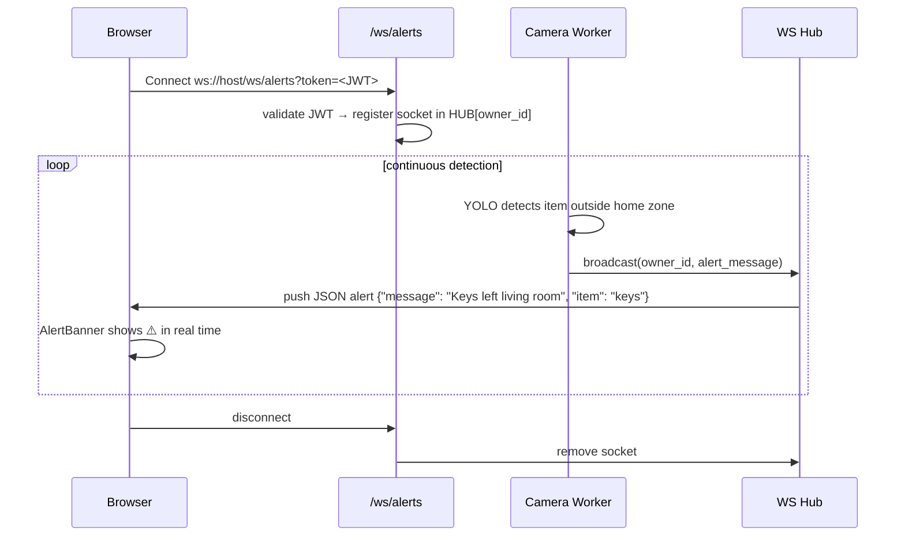

# Task 3 — FastAPI Architecture

> **Owner:** Shubham | **Stack:** FastAPI · Uvicorn · JWT (python-jose) · bcrypt · SQLAlchemy · WebSockets

---

## Router Map



---

## Authentication Flow



---

## File Structure

```
backend/
├── main.py                  # app factory, router registration, CORS, startup
├── auth.py                  # JWT create/decode, bcrypt, get_current_user dependency
├── config.py                # Settings (SECRET_KEY, ALGORITHM, DB URL from .env)
├── models/                  # SQLAlchemy ORM (see Task 2)
├── schemas/                 # Pydantic request/response models
│   ├── user.py
│   ├── item.py
│   ├── zone.py
│   ├── camera.py
│   ├── alert.py
│   ├── assistant.py         # AssistantRequest, AssistantResponse
│   ├── detection.py
│   └── reminder.py
├── routers/
│   ├── auth.py
│   ├── items.py
│   ├── zones.py
│   ├── cameras.py
│   ├── assistant.py
│   ├── scan.py
│   ├── detections.py
│   ├── reminders.py
│   └── ws.py               # WebSocket hub
└── services/
    ├── assistant.py         # AssistantBrain (Task 1)
    ├── vision.py            # YOLO detect wrapper
    ├── camera_worker.py     # background frame loop
    └── alerts.py            # zone breach checker
```

---

## Key API Contracts

### POST /api/assistant
```
Request:  { "text": "where is my phone?" }
Response: {
    "reply":  "Your phone was last seen in the living room, 3 minutes ago.",
    "intent": "locate_item",
    "data":   { "item": "phone", "zone": "living room", "seconds_ago": 180 }
}
```

### POST /api/scan
```
Request:  multipart/form-data — image file (JPEG)
Response: {
    "detections": [
        { "object_class": "cell phone", "confidence": 0.91, "zone_name": "sofa area", "bbox": [120,80,240,200] }
    ]
}
```

### GET /api/reminders/due
```
Response: [{ "id": 3, "text": "Take medication", "remind_at": "2026-06-26T09:00:00" }]
Side effect: marks returned reminders done=true in same transaction
```

---

## WebSocket Alert Protocol



---

## Environment Variables

```bash
# .env
SECRET_KEY=your-random-32-char-secret
ALGORITHM=HS256
ACCESS_TOKEN_EXPIRE_MINUTES=1440   # 24h
DATABASE_URL=sqlite:///./visionassist.db
OPENAI_API_KEY=sk-...              # for LLM fallback
CAMERA_SOURCE=0                    # 0=webcam, or rtsp:// URL
```

---

## Startup Command

```bash
# inside container
uvicorn backend.main:app --host 0.0.0.0 --port 8000 --reload

# interactive API docs auto-generated at:
# http://localhost:8000/docs   (Swagger UI)
# http://localhost:8000/redoc  (ReDoc)
```
