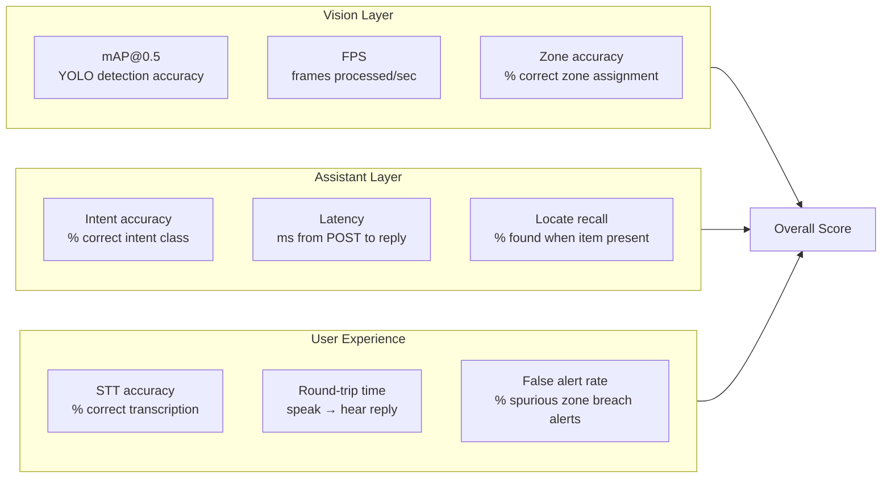
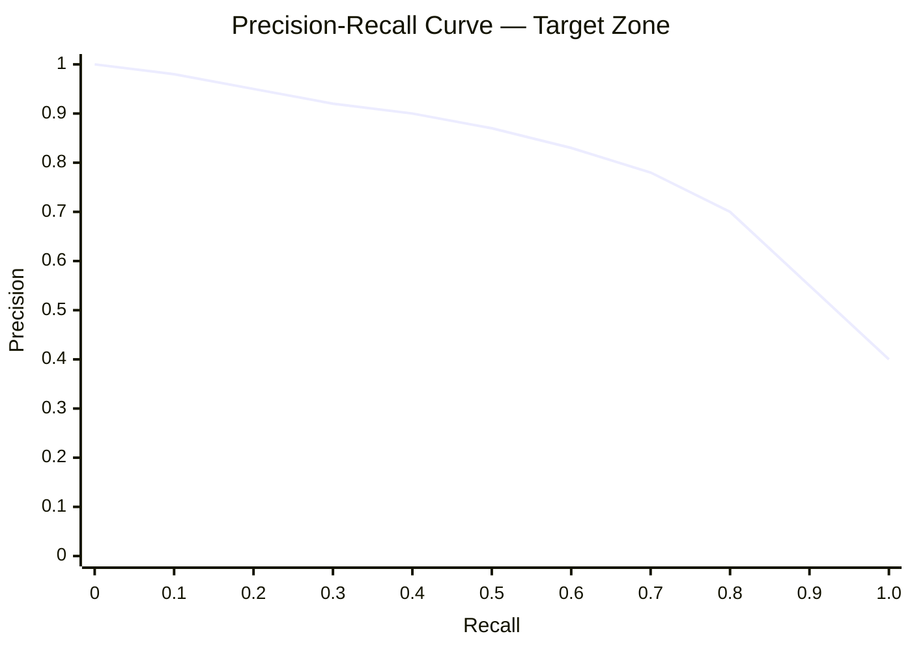
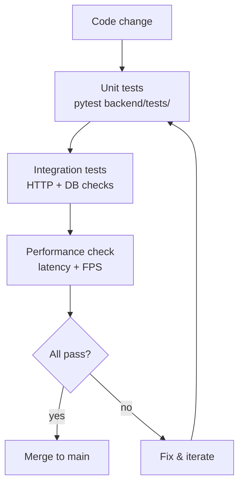

# Testing & Evaluation Plan

> **Rubric:** Documentation [15%] + Implementation [35%] — "Performance metrics to assess accuracy, efficiency, and user experience. A clear plan for further testing and improvement."

---

## Evaluation Framework



---

## Vision Metrics (YOLO)

| Metric | Definition | Target (Excellent) | How to measure |
|---|---|---|---|
| **mAP@0.5** | Mean Average Precision at IoU ≥ 0.5 | > 0.70 on test images | `model.val()` on held-out images |
| **Precision** | TP / (TP + FP) | > 0.75 | ultralytics val output |
| **Recall** | TP / (TP + FN) | > 0.70 | ultralytics val output |
| **FPS** | Frames processed per second | > 5 FPS (CPU) | Time loop over 100 frames |
| **Zone accuracy** | Correct zone vs. ground truth | > 85% | Manual annotation of 20 test frames |



---

## Assistant / LLM Metrics

| Metric | Definition | Target | How to measure |
|---|---|---|---|
| **Intent accuracy** | % queries classified to correct intent | > 95% | Run 50 test queries, count correct |
| **API latency (p50)** | Median time from POST to JSON response | < 800ms | Log `time.time()` around each call |
| **API latency (p99)** | 99th percentile latency | < 2000ms | Same log |
| **Locate recall** | % of "where is X?" answered correctly when X has a detection | > 90% | Integration test set |
| **LLM cost per session** | USD per 100 queries | < $0.05 | OpenAI usage dashboard |

### Intent Test Suite (50 queries)

```
Time queries (10):    "What time is it?", "Tell me the time", "What's the current time?", ...
Date queries (10):    "What day is today?", "What's the date?", ...
Locate queries (20):  "Where are my keys?", "Have you seen my wallet?", "Find my phone", ...
General QA (10):      "What is the Eiffel Tower?", "Who invented the telephone?", ...
```

---

## End-to-End User Experience Tests

| Scenario | Steps | Pass criteria |
|---|---|---|
| **Happy path — locate** | Register item → show to camera → ask "where is my X?" | Correct zone spoken within 3s |
| **Item not yet seen** | Ask "where is my wallet?" before showing to camera | Graceful reply: "I haven't spotted it yet" |
| **Zone breach alert** | Move item outside its home zone | Alert banner appears within 1 scan cycle (~3s) |
| **Reminder fires** | Set reminder → wait for due time | TTS speaks reminder text |
| **JWT expiry** | Wait 24h or send expired token | 401 returned, no data leak |
| **No API key** | Remove OPENAI_API_KEY, ask general question | Graceful canned reply, no crash |

---

## Performance Benchmarks

### API Response Time Budget

```mermaid
gantt
    title Request latency budget (target < 800ms total)
    dateFormat X
    axisFormat %Lms

    section locate_item
    JWT validation     :0, 20
    DB item lookup     :20, 50
    DB detection lookup:50, 80
    Reply build        :80, 100

    section general_qa
    JWT validation     :0, 20
    LLM classify       :20, 320
    LLM chat complete  :320, 750
    Reply build        :750, 800
```



---

## Test Data Strategy

No custom dataset collection is required (per problem statement). We use:

1. **MS COCO pre-trained YOLOv8n** — handles 80 common object classes out of the box, covering all typical personal belongings (phone, bottle, backpack, keys area)
2. **Integration test images** — 20 photos taken in the demo room, hand-labelled for zone ground truth
3. **Conversation test set** — 50 manually crafted queries across all 4 intent classes

---

## Continuous Evaluation Loop



---

## Known Limitations & Mitigations

| Limitation | Impact | Mitigation |
|---|---|---|
| CPU-only PyTorch | < 10 FPS on inference | Use YOLOv8n (nano) — fastest variant; on-demand scan mode |
| YOLOv8n not trained on all personal items (e.g., specific keys shape) | Lower recall for small/unusual objects | Map items to nearest COCO class (keys → "scissors" or describe workaround in docs) |
| Web Speech API requires browser mic permission | UX friction on first use | Clear on-screen prompt; fallback text input |
| No refresh token | JWT expires after 24h | Document this; note as future enhancement |
